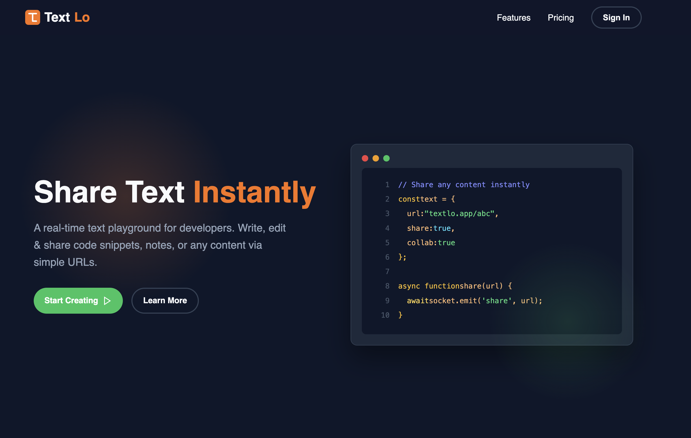

# TextLo - Real-time Collaborative Playground

TextLo is a sleek, real-time collaborative text and code playground. Built for developers and teams who need to share snippets, ideas, or collaborative notes instantly, TextLo allows anyone to create a playground just by typing a URL.

**Live Demo**: [text-lo.onrender.com](https://text-lo.onrender.com/)



## Features

- **Instant Playgrounds**: Simply type any URL (e.g., `textlo.com/my-cool-code`) and start typing. The playground is created automatically.
- **Real-time Collaboration**: Powered by Socket.io, multiple users can edit the same document simultaneously with zero lag.
- **Professional Editor**: Integrated with Monaco Editor (the engine behind VS Code), providing syntax highlighting, auto-completion, and a familiar coding experience.
- **Multi-language Support**: Supports JavaScript, TypeScript, Python, HTML, CSS, JSON, Markdown, and more.
- **Persistent Storage**: Your content is automatically saved to MongoDB, so you can come back to it anytime.
- **Access Control**: (Upcoming) Private stores and read-only modes for authenticated users.

## Tech Stack

- **Backend**: [Node.js](https://nodejs.org/) & [Express 5](https://expressjs.com/)
- **Language**: [TypeScript](https://www.typescriptlang.org/)
- **Real-time**: [Socket.io](https://socket.io/)
- **Database**: [MongoDB](https://www.mongodb.com/) with [Mongoose](https://mongoosejs.com/)
- **Frontend**: HTML5, CSS3, [EJS](https://ejs.co/) & [Monaco Editor](https://microsoft.github.io/monaco-editor/)
- **Validation**: [Zod](https://zod.dev/)
- **Authentication**: [JWT](https://jwt.io/) & [bcrypt](https://www.npmjs.com/package/bcrypt)

## Getting Started

### Prerequisites

- Node.js (v18 or higher)
- pnpm (recommended) or npm
- MongoDB (running locally or via Docker)

### Installation

1. **Clone the repository**:
   ```bash
   git clone https://github.com/PankajKumar1947/Text-Lo.git
   cd Text-Lo
   ```

2. **Install dependencies**:
   ```bash
   pnpm install
   ```

3. **Set up environment variables**:
   Create a `.env` file in the root directory:
   ```env
   MONGO_URI=mongodb://localhost:27017/textlo
   PORT=9000
   JWT_SECRET=your_super_secret_key
   ```

4. **Run in development mode**:
   ```bash
   pnpm run dev
   ```

5. **Build for production**:
   ```bash
   pnpm run build
   pnpm start
   ```

## Project Structure

```text
textlo/
├── src/
│   ├── auth/           # Authentication logic (JWT, bcrypt)
│   ├── common/         # Database config, middleware, utilities
│   ├── socket/         # Socket.io handlers for real-time collaboration
│   ├── store/          # Store (playground) logic and routes
│   ├── app.ts          # Express application setup
│   └── index.ts        # Entry point (HTTP & Socket server)
├── public/             # Static assets (CSS, JS, images)
├── views/              # EJS templates (Playground, Auth)
├── docker-compose.yaml # Infrastructure setup
└── package.json        # Dependencies and scripts
```

## Roadmap

- [ ] **User Dashboards**: Manage your saved playgrounds.
- [ ] **Private Playgrounds**: Password protection and private access.
- [ ] **Custom Expiration**: Set playgrounds to expire after a certain time.
- [ ] **Rich Themes**: Support for VS Code themes in the editor.

## License

This project is licensed under the ISC License.

---
Developed by [Pankaj Kumar](https://github.com/PankajKumar1947)
